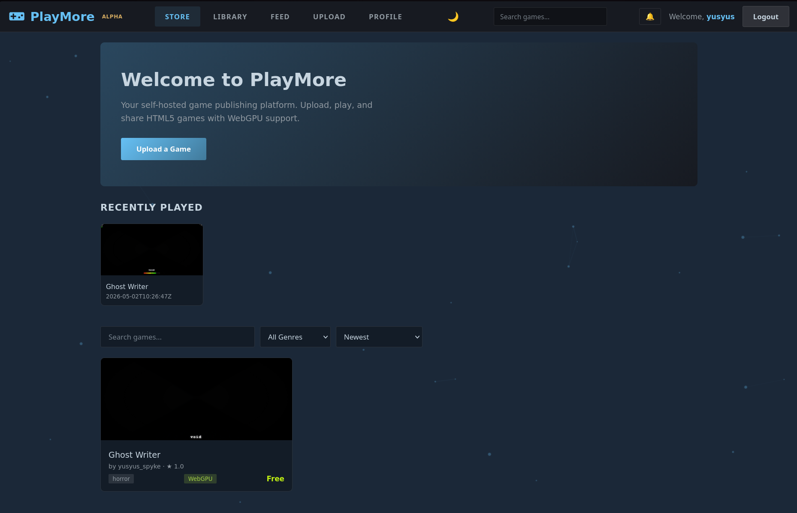
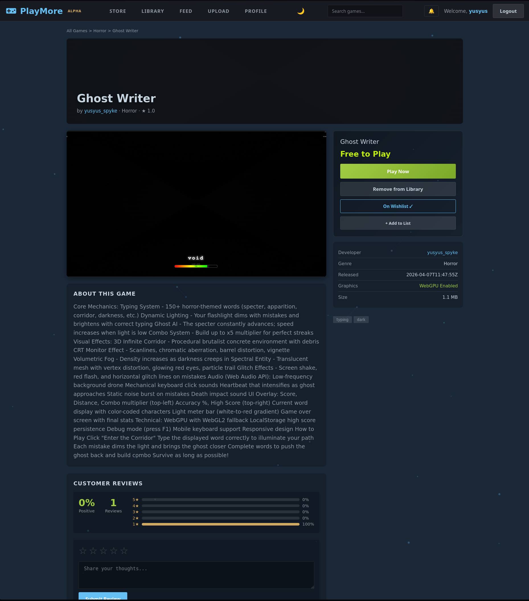
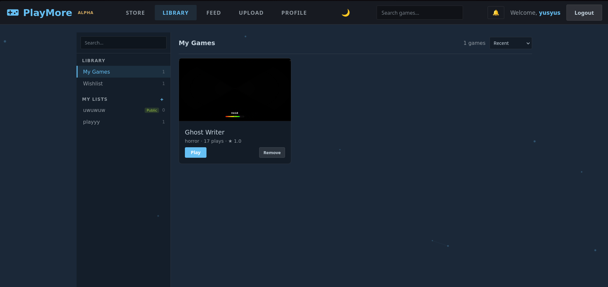
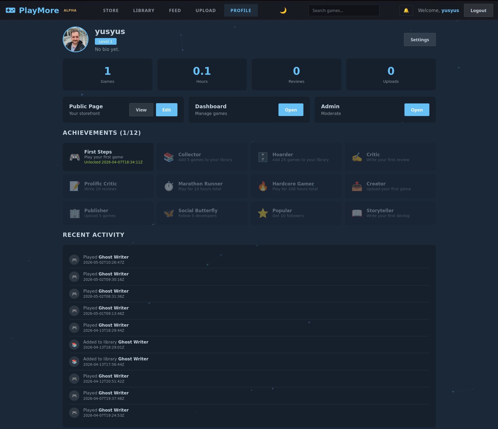
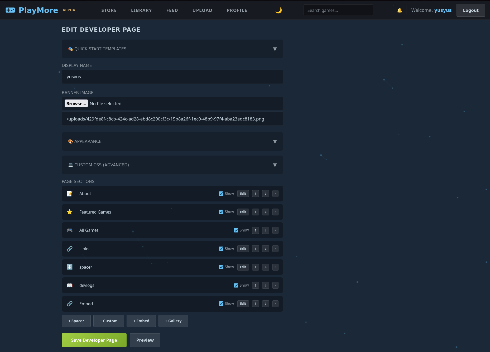
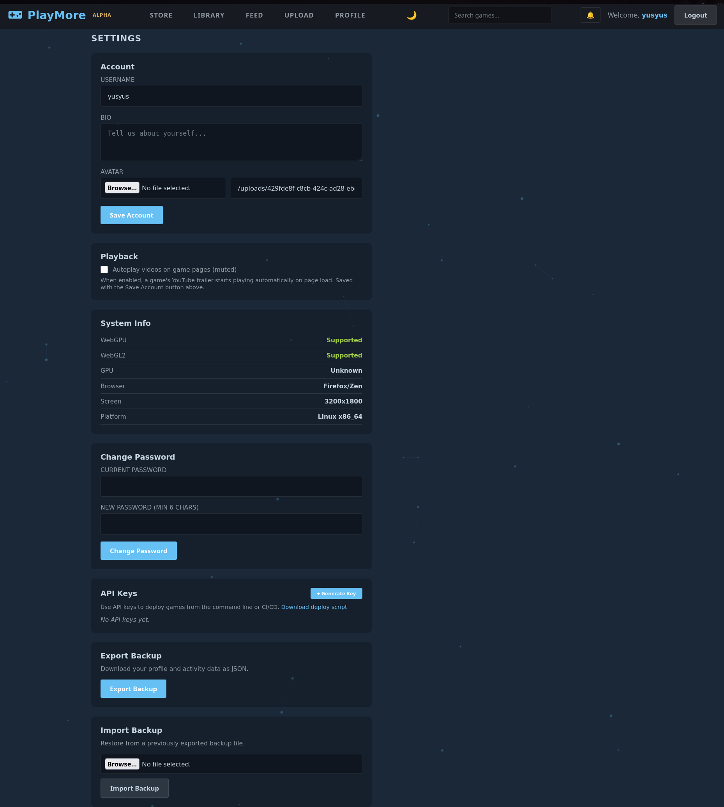

# PlayMore

> **Inspired by Steam. Powered by WebGPU. Hosted by you.** With customizable profile pages — a salute to the indie web.

[](#)
[](LICENSE)
[](https://go.dev)
[](docker-compose.yml)

**🎮 [Try the live demo at playmore.world](https://playmore.world)** — real games running in your browser right now.

PlayMore is a **self-hosted game publishing platform** that gives indie developers their own storefront — think Steam, but you own the server, control the experience, and your games run natively in the browser with **WebGPU, WebAssembly, and WebGL2**.

No walled gardens. No algorithm feeds. No 30% cut. Just your games, your community, your platform.

---

## Screenshots

<table>
  <tr>
    <td></td>
    <td></td>
  </tr>
  <tr>
    <td align="center"><b>Store</b> — Browse with search, filters, and WebGPU badges</td>
    <td align="center"><b>Game Page</b> — Rich detail with reviews, trailers, and play button</td>
  </tr>
  <tr>
    <td></td>
    <td></td>
  </tr>
  <tr>
    <td align="center"><b>Library</b> — Steam-style sidebar with collections</td>
    <td align="center"><b>Profile</b> — Achievements, stats, and activity feed</td>
  </tr>
  <tr>
    <td></td>
    <td></td>
  </tr>
  <tr>
    <td align="center"><b>Developer Page Editor</b> — Drag-and-drop storefront builder</td>
    <td align="center"><b>Settings</b> — API keys, backups, and system info</td>
  </tr>
</table>

---

## Features

### For Players

- **Steam-like Store** — Search (FTS5), genre filters, sort options, hero banners, discounts
- **Game Library** — Personal library, wishlist, and custom public/private collections
- **Rich Game Pages** — Trailers, screenshots, reviews, devlogs, WebGPU capability badges
- **Achievement System** — 12 unlockable achievements with progress tracking
- **Activity Feed** — Timeline of plays, reviews, follows, and library adds
- **Fullscreen Player** — Iframe with gamepad, pointer-lock, fullscreen, and session timer

### For Developers

- **Customizable Storefront** — Drag-and-drop page builder with themes, banners, and custom CSS
- **Game Upload** — Drag-and-drop `.html` or `.zip`, auto-extracts, detects entry point
- **WebGPU Badge** — Automatic capability detection and badge display per game
- **Reviews & Devlogs** — Full content layer with comments
- **Analytics Dashboard** — Views, plays, ratings, referrers, daily breakdown
- **API Keys & CLI Deploy** — Deploy from command line or CI/CD pipelines
- **Email Verification** — Built-in auth with verification, password reset, CAPTCHA

### Platform

- **Single Binary** — One `playmore` executable, zero runtime dependencies
- **Embedded Frontend** — Entire SPA baked into the binary (`go:embed`)
- **SQLite Database** — Single file, WAL mode, FTS5 search, zero config
- **Sandboxed Games** — Optional `--games-domain` for full origin isolation
- **Auto-TLS** — Let's Encrypt with single flag (`--auto-tls`)
- **Docker Ready** — `docker-compose up -d` and you're live
- **Dark/Light Mode** — Toggle themes with system preference support

---

## Quick Start

**Try it first:** [playmore.world](https://playmore.world) is a public instance running the latest build — sign up and explore before installing.

```bash
# Build
go build -o playmore

# Interactive setup wizard (creates .env, optional)
./playmore setup

# Run — http://localhost:8080
./playmore

# Seed demo data (4 games with reviews)
curl -X POST http://localhost:8080/api/seed
```

**Guides:**
- [Setup Guide](docs/SETUP.md) — production config, HTTPS, email, systemd
- [Developer Guide](docs/DEVELOPER.md) — API keys, deploy CLI, API reference
- [ProtonMail Bridge](docs/SETUP_PROTONMAIL_BRIDGE.md) — email via Proton

### Docker

```bash
docker-compose up -d
```

---

## Why PlayMore?

**Own your platform.** No algorithm deciding who sees your game. No platform fees. No sudden policy changes. Your server, your rules, your community.

**WebGPU-first.** Modern browser games deserve modern APIs. PlayMore detects and badges WebGPU support, so players know what they're getting.

**Indie web native.** Built for the open web — no app stores, no downloads, no gatekeepers. Players click and play instantly.

**Fully customizable.** Developer pages support custom CSS, themes, banners, and drag-and-drop layouts. Make your storefront look like *you*.

**Privacy by default.** Self-hosted means player data stays on your server. No third-party tracking (optional GoatCounter integration if you want analytics).

---

## Production Deployment

### Option 1: Reverse Proxy (Recommended)

**Caddy** (auto HTTPS, zero config):
```
playmore.example.com {
    reverse_proxy localhost:8080
}
```

**Nginx** with certbot:
```nginx
server {
    listen 443 ssl;
    server_name playmore.example.com;

    ssl_certificate /etc/letsencrypt/live/playmore.example.com/fullchain.pem;
    ssl_certificate_key /etc/letsencrypt/live/playmore.example.com/privkey.pem;

    location / {
        proxy_pass http://localhost:8080;
        proxy_set_header Host $host;
        proxy_set_header X-Forwarded-Proto $scheme;
        proxy_set_header X-Forwarded-For $proxy_add_x_forwarded_for;
    }
}
```

Session cookies automatically get the `Secure` flag when `X-Forwarded-Proto: https` is set.

### Option 2: Direct TLS

```bash
./playmore --tls-cert cert.pem --tls-key key.pem --port 443
```

### Option 3: Auto-TLS (Let's Encrypt)

```bash
./playmore --auto-tls --domain playmore.example.com
```

---

## Tech Stack

- **Backend:** Go 1.26+ + Gin + SQLite (pure Go, no CGO)
- **Frontend:** Vanilla JS SPA (~3500 lines), no framework, no build step
- **Database:** SQLite (single file, WAL mode, FTS5 full-text search)
- **Auth:** bcrypt (cost 12) + 256-bit session tokens (SHA-256 hashed at rest) + Bearer API keys
- **Deploy:** Single binary with embedded frontend (`go:embed`)

---

## Game Compatibility

Tested with games built using:

- **Godot 4** — Web export with WebGPU/WebGL2
- **Unity 6** — WebGL build, including IL2CPP
- **Bevy** — `wasm-bindgen` output
- **Babylon.js** — WebGPU + WebXR
- **Three.js** — WebGL2 + WebGPU experimental
- **Plain HTML/JS/Canvas** — Drop in and play

Range requests + immutable cache headers mean even 100+ MB WASM builds load fast on repeat visits.

---

## Security

PlayMore is security-hardened with defense-in-depth:

- **Passwords:** bcrypt cost-12 with automatic rehashing
- **Sessions:** 256-bit tokens, SHA-256 hashed at rest, HTTP-only SameSite=Lax cookies
- **CSRF:** Origin/Referer validation on all state-changing requests
- **CSP:** Per-request nonce-based Content Security Policy
- **Rate Limiting:** Per-IP and per-account limits on auth endpoints
- **File Uploads:** Path traversal protection, ZIP bomb defense, extension filtering
- **SQL Injection:** 100% parameterized queries throughout
- **XSS:** Frontend HTML escaping + server-side sanitization
- **Game Isolation:** Optional separate origin (`--games-domain`) + iframe sandbox

See [SECURITY.md](SECURITY.md) for responsible disclosure.

---

## v1 Archive

The original single-file HTML prototype is archived in `v1/`. Open `v1/index.html` in a browser — no server needed. Auto-deployed to GitHub Pages on pushes to `v1/**`.

---

## Contributing

See [CONTRIBUTING.md](CONTRIBUTING.md) for code style, conventions, and how to submit changes.

## License

MIT — see [LICENSE](LICENSE). Third-party attributions in [NOTICE](NOTICE).
